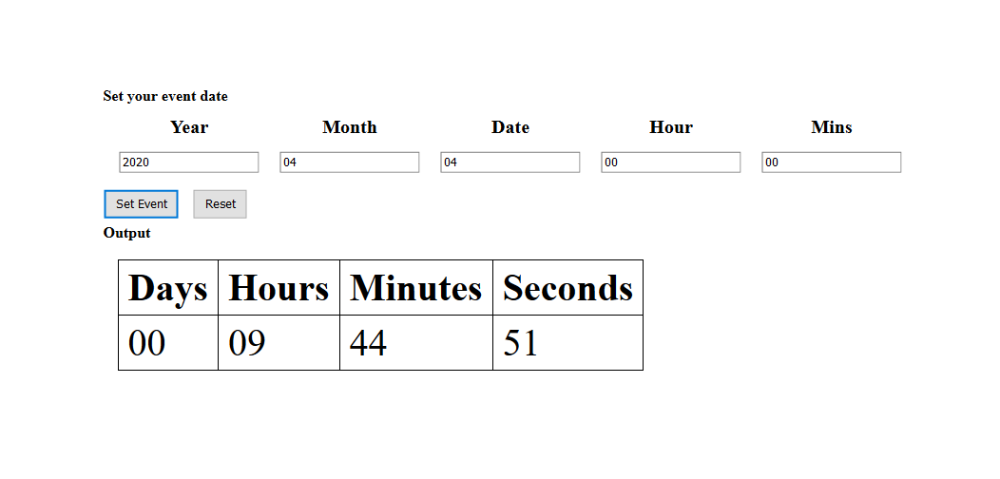

# countdownJS
A countdown created using JavaScript, HTML and CSS. 

The user has to set an event date specifying the year, month, date, hour and mins.

After pressing the set event button, the days, hours, mins and secs left until that event will be shown and countdown will be started.

The user can press the reset button and add a new event too.

